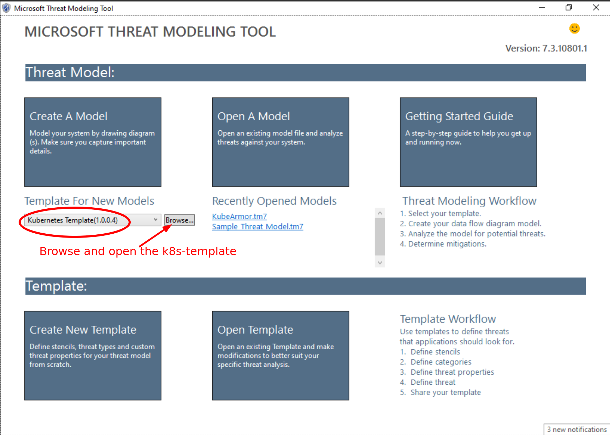

# Practical Threat Modeling

This guide will be focussing on the STRIDE approach for threat modeling and
will be using Microsoft's [MSTMT
app](https://docs.microsoft.com/en-us/azure/security/develop/threat-modeling-tool-getting-started).
We have prepared a [k8s-stencils-template](./templates/k8s-STRIDE-template.tb7)
that could be used with the tool making it easier to model applications,
services, agents based on k8s.

Threat Modeling is handled in following steps:

1. **Tool-Preparation**:
	* Download [MS-TMT app](https://aka.ms/threatmodelingtool)
	* Download [k8s-stencils-template](./templates/k8s-STRIDE-template.tb7)
	
Startup    | Demo
:---------:|:---------------------------:
 | 

2. **MODEL-Preparation**: This step involves
	* preparing a system's interaction diagram or deployment architecture
	* specifying the trust boundaries
	Reuse existing system design diagrams and apply trust boundaries as
	necessary. Note that it is not necessary to get all the interactions
	correct in the first phase. You can have a simplistic view and then later
	keep on adding new entities/components to your model and apply new trust
	boundaries.

2. 

